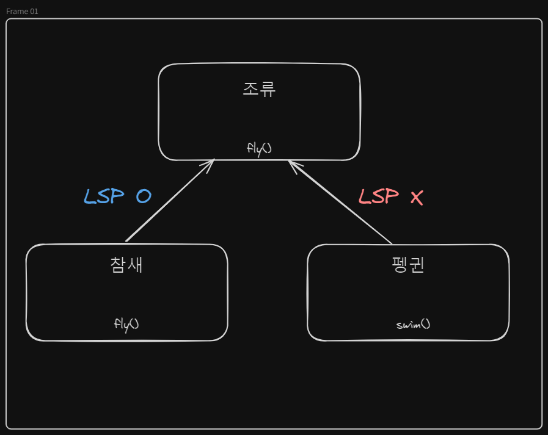

## 개요
SOLID 원칙은 객체 지향 프로그래밍 언어를 염두에 두고 구상되고 설명되었습니다. 이러한 원칙과 설명은 클래스와 인터페이스의 개념에 크게 의존하지만 JS에는 실제로 그런 개념이 없습니다.

JS의 클래스는 prototype과 prototype chaining을 사용한 클래스의 유사체일 뿐이며 인터페이스는 존재하지 않습니다(단, Typescript를 사용하면 인터페이스 활용 가능).

더 나아가서 React 코드를 작성하는 방식은 객체 지향과는 거리가 멉니다. 함수형에 더 가깝습니다.

그래서 SOLID원칙을 좀 더 자세히 살펴보고 함수형 React 코드에 적용하기 위해서 <mark style="background: #BBFABBA6;">약간의 해석 및 적용 변형이 필요</mark>합니다.

<br />
<br />
<br />
<br />

## 단일 책임 원칙(SRP, Single Responsibility Principlele)

- 단일 책임 원칙은 **클래스(객체)는 단 하나의 책임만 가져야 한다**는 원칙입니다.
- 여기서 '**책임**'이라는 의미는 하나의 '**기능 담당**'으로 보면 됩니다.
- 즉 **하나의 클래스는 하나의 기능만을 담당하여 하나의 책임을 수행**하는데 집중하도록 클래스를 따로따로 여러 개 설계하라는 원칙입니다.

<br />

### 리액트에 대입

이를 리액트에 대입시키면 "모든 함수/모듈/컴포넌트는 정확히 한 가지 작업을 수행해야 한다."라는 정의로 해석할 수 있습니다.

SRP는 5가지 원칙 중 가장 따르기 쉬운 원칙입니다.
SRP를 지키기 위해 다음을 고려하여 수행할 수 있습니다.
- 너무 많은 작업을 수행하는 컴포넌트를 더 작은 컴포넌트로 나눔
- 주요 컴포넌트 기능과 관련 없는 코드를 별도의 유틸리티 함수로 추출
- 관련 있는 기능들을 커스텀 hook으로 캡슐화

이제 이 원칙을 적용하는 방법을 살펴보겠습니다.
다음은 활성 사용자 목록을 표시하는 예제 컴포넌트 코드입니다.
```jsx
const ActiveUsersList = () => {
  const [users, setUsers] = useState([]);

  useEffect(() => {
    const loadUsers = async () => {
      const response = await fetch("/some-api");
      const data = await response.json();
      setUsers(data);
    };

    loadUsers();
  }, []);

  const weekAgo = new Date();
  weekAgo.setDate(weekAgo.getDate() - 7);

  return (
    <ul>
      {users
        .filter((user) => !user.isBanned && user.lastActivityAt >= weekAgo)
        .map((user) => (
          <li key={user.id}>
            
            <p>{user.fullName}</p>
            <small>{user.role}</small>
          </li>
        ))}
    </ul>
  );
};
```

이 컴포넌트는 데이터를 가져오고, 필터링하고, 컴포넌트 자체와 목록의 각 항목을 렌더링는 등 이미 많은 작업을 수행하고 있습니다.
이를 나눠보도록 하겠습니다.

<br />
<br />

#### 커스텀 hook으로 추출하기
우선 서로 연관된 `useState`와 `useEffect`가 있을 때는 언제든지 커스텀 hook으로 추출할 수 있습니다.

```jsx
const useUsers = () => {
  const [users, setUsers] = useState([]);

  useEffect(() => {
    const loadUsers = async () => {
      const response = await fetch("/some-api");
      const data = await response.json();
      setUsers(data);
    };

    loadUsers();
  }, []);

  return { users };
};

const ActiveUsersList = () => {
  const { users } = useUsers();

  const weekAgo = new Date();
  weekAgo.setDate(weekAgo.getDate() - 7);

  return (
    <ul>
      {users
        .filter((user) => !user.isBanned && user.lastActivityAt >= weekAgo)
        .map((user) => (
          <li key={user.id}>
            
            <p>{user.fullName}</p>
            <small>{user.role}</small>
          </li>
        ))}
    </ul>
  );
};
```

`useUsers`훅은 오직 API에서 사용자를 가져오는 것 하나에만 관련되어 있습니다. 또한 `ActiveUsersList`컴포넌트 내부의 코드가 짧아지고 `useUsers`라는 커스텀 훅의 이름 덕분에 선언적으로 용도를 파악할 수 있기 때문에 읽기 더 쉬워졌습니다.

<br />
<br />

#### 렌더링 로직 분리

다음으로 컴포넌트가 렌더링하는 JSX를 살펴보겠습니다. 객체 배열을 순회하며 매핑하는 경우 배열의 각 항목에 대해 생성하는 JSX의 복잡성에 주의를 기울여야 합니다. <br />
<mark style="background: #FFB8EBA6;">이벤트 핸들러가 연결되지 않은 한 줄짜리 마크업인 경우 인라인으로 유지</mark>하는 것이 좋지만 <mark style="background: #ADCCFFA6;">더 복잡한 마크업의 경우 별도의 컴포넌트로 추출</mark>하는 것이 좋습니다.

```jsx
const UserItem = ({ user }) => {
  return (
    <li>
      
      <p>{user.fullName}</p>
      <small>{user.role}</small>
    </li>
  );
};

const ActiveUsersList = () => {
  const { users } = useUsers();

  const weekAgo = new Date();
  weekAgo.setDate(weekAgo.getDate() - 7);

  return (
    <ul>
      {users
        .filter((user) => !user.isBanned && user.lastActivityAt >= weekAgo)
        .map((user) => (
          <UserItem key={user.id} user={user} />
        ))}
    </ul>
  );
};
```
사용자 항목을 렌더링하는 로직을 별도의 컴포넌트로 분리한 덕분에 메인 컴포넌트인 `ActiveUsersList`컴포넌트 내부 로직의 가독성이 더 좋아졌습니다.

<br />
<br />

#### 유틸 함수 분리

마지막으로 API로부터 얻은 전체 사용자 목록에서 비활성 사용자를 필터링하는 로직이 있습니다. 이 로직은 비교적 독립되어 있고 애플리케이션의 다른 부분에서 재사용될 수 있으므로 유틸리티 함수로 쉽게 추출할 수 있습니다.
```jsx
const getOnlyActive = (users) => {
  const weekAgo = new Date();
  weekAgo.setDate(weekAgo.getDate() - 7);

  return users.filter(
    (user) => !user.isBanned && user.lastActivityAt >= weekAgo
  );
};

const ActiveUsersList = () => {
  const { users } = useUsers();

  return (
    <ul>
      {getOnlyActive(users).map((user) => (
        <UserItem key={user.id} user={user} />
      ))}
    </ul>
  );
};
```

<br />

데이터를 페칭한 다음 필터링을 적용하고 있지만 추가 조작 없이 데이터를 가져와 렌더링하기만 하는 것이 이상적입니다. 따라서 마지막 개선 사항으로 이 로직을 <mark style="background: #BBFABBA6;">새로운 커스텀 hook으로 캡슐화</mark>할 수 있습니다.

```jsx
const useActiveUsers = () => {
  const { users } = useUsers();

  const activeUsers = useMemo(() => {
    return getOnlyActive(users);
  }, [users]);

  return { activeUsers };
};

const ActiveUsersList = () => {
  const { activeUsers } = useActiveUsers();

  return (
    <ul>
      {activeUsers.map((user) => (
        <UserItem key={user.id} user={user} />
      ))}
    </ul>
  );
};
```

 SRP의 '단 하나의 책임만 가져야 한다.'라는 규칙을 따져보았을 때 누군가 위 컴포넌트는 여전히 먼저 데이터를 얻은 다음 렌더링하기 때문에 '하나의 책임'이 아니라고 주장할 수도 있습니다. 비즈니스와 뷰 로직이 함께 있는 것처럼 보이기 때문이죠.
 
 이를 충족시키기 위해 한 컴포넌트에서 hook을 호출한 다음 그 결과를 다른 컴포넌트에 props로 전달해서 더 나눌 수 있습니다.
 
 그러나 함수형 컴포넌트와 훅의 도입 이후부터는 데이터 로직과 뷰 로직을 그렇게까지 나누지는 않고 있고 그렇게 나눈다고 해도 실제로 이로운 경우는 거의 없습니다.

<br />
<br />

>리액트 훅의 도입 전에는 비즈니스 로직과 뷰 로직을 분리하기 위한 컴포넌트를 작성하곤 했습니다.

리액트 훅의 도입 전에 관심사의 분리(SoC, separation of concerns)를 강제하는 방법은 Container/Presentational Pattern을 이용하는 방법이 있었습니다. Presentational Components는 뷰 로직을 다루는 표현을 위한 컴포넌트이고, Container Components는 비즈니스 로직을 다루는 컴포넌트로 사용합니다.
이를 통해 비즈니스 로직과 뷰 로직을 분리해낼 수 있었습니다.<br />
하지만 리액트 훅이 이를 완전히 대체할 수 있어 더 이상 권장되지 않는 패턴입니다.
[Container/Presentational 참고](https://patterns-dev-kr.github.io/design-patterns/container-presentational-pattern/)

<br />
<br />
<br />
<br />

## 개방-폐쇄 원칙(OCP, Open Closed Principle)
- OCP 원칙은 클래스는 '**확장에 열려있어야 하며, 수정에는 닫혀있어야 한다**'를 뜻합니다.
- 기능 추가 요청이 오면 **클래스를 확장을 통해 손쉽게 구현**하면서, **확장에 따른 클래스 수정은 최소화**하도록 프로그램을 작성해야 하는 설계 기법입니다.
개방-폐쇄 원칙은 원본 소스 코드를 변경하지 않고 확장할 수 있는 방식으로 구성 요소를 구조화하도록 권고합니다.

<br />

`Header`컴포넌트를 예시로 들어보도록 하겠습니다.<br />
`Header`컴포넌트를 여러 페이지에서 공유하고 있으되, 현재 있는 페이지에 따라 조금 다른 UI를 렌더링 해야 하는 상황이라고 가정해보겠습니다.

```jsx
const Header = () => {
  const { pathname } = useRouter();

  return (
    <header>
      <Logo />
      <Actions>
        {pathname === "/dashboard" && (
          <Link to="/events/new">Create event</Link>
        )}
        {pathname === "/" && <Link to="/dashboard">Go to dashboard</Link>}
      </Actions>
    </header>
  );
};

const HomePage = () => (
  <>
    <Header />
    <OtherHomeStuff />
  </>
);

const DashboardPage = () => (
  <>
    <Header />
    <OtherDashboardStuff />
  </>
);
```

현재 경로별로 다른 컴포넌트를 렌더링하도록 하고 있네요.<br />
코드를 딱 한 번 봐도 더 많은 페이지를 추가하기 시작할 때 어떤 일이 일어날지 생각하면 이 구현이 나쁘다는 것을 쉽게 알 수 있습니다.<br />
새 페이지가 생성될 때마다 `Header` 컴포넌트로 돌아가서 렌더링할 작업 링크를 알 수 있도록 구현을 조정해야 합니다.<br />
이러한 접근 방식은 `Header` 컴포넌트는 취약해지고 사용되는 컨텍스트와 긴밀하게 결합되어, 개방-폐쇄 원칙에 위배됩니다.

<br />
<br />

### 컴포넌트 합성(component composition)

이 문제를 해결하기 위해 컴포넌트 합성(component composition)을 사용할 수 있습니다. Header 컴포넌트는 내부에서 무엇을 렌더링할지 신경 쓸 필요가 없으며 대신 `children` prop을 사용해서 Header를 사용할 컴포넌트에게 이 책임을 위임할 수 있습니다.

```jsx
const Header = ({ children }) => (
  <header>
    <Logo />
    <Actions>{children}</Actions>
  </header>
);

const HomePage = () => (
  <>
    <Header>
      <Link to="/dashboard">Go to dashboard</Link>
    </Header>
    <OtherHomeStuff />
  </>
);

const DashboardPage = () => (
  <>
    <Header>
      <Link to="/events/new">Create event</Link>
    </Header>
    <OtherDashboardStuff />
  </>
);
```


`Header`에서 이러한 props를 사용하는 컴포넌트로 일부 컨텍스트를 전달해야 하는 경우 [Passing JSX as children](https://ko.react.dev/learn/passing-props-to-a-component#passing-jsx-as-children)을 사용할 수 있습니다. 보시다시피 합성(composition)은 매우 강력합니다.

<br />
<br />
<br />
<br />

## 리스코프 치환 법칙 (LSP, Liskov Substitution Principle)
- 부모 클래스의 인스턴스를 사용하는 위치에 자식 클래스의 인스턴스를 대신 사용했을 때 코드가 원래 의도대로 작동해야 한다는 의미입니다.
- **하위 타입 객체는 상위 타입 객체에서 가능한 행위를 수행할 수 있어야 합니다.**
- 올바른 상속을 위해 **자식 객체의 확장이 부모 객체의 방향을 온전히 따르도록 권고하는 원칙**입니다.
아주 단순하게 정의하면, LSP는 "하위 타입 객체가 상위 타입 객체를 대체할 수 있는" 객체 간의 관계 유형입니다.



이 원칙은 하위 타입과 상위 타입 관계를 정의하기 위해 **클래스 상속에 크게 의존**하지만, 클래스 상속은 고사하고 <mark style="background: #FF5582A6;">클래스를 거의 다루지 않기 때문에 React에서는 거의 적용할 수 없습니다.</mark> 클래스 상속에서 벗어나면 필연적으로 이 원칙이 완전히 다른 것으로 바뀌겠지만 상속을 사용하여 React 코드를 작성하면 의도적으로 나쁜 코드를 만들게 되므로(React 팀에서 [매우 권장하지 않음. 합성을 권장함](https://reactjs.org/docs/composition-vs-inheritance.html)) 이 원칙은 넘어가겠습니다.

<br />
<br />
<br />
<br />

## 인터페이스 분리 원칙(ISP, Interface Segregation Principle)
- **인터페이스를 각각 사용에 맞게끔 잘게 분리해야한다는 설계 원칙**입니다.
- SRP 원칙이 **클래스의 단일 책임**을 강조한다면, ISP는 **인터페이스의 단일 책임**을 강조하는 것으로 보면 됩니다.

React 애플리케이션을 위해 이것을 "컴포넌트는 사용하지 않는 props에 의존해서는 안 됩니다"로 해석하겠습니다.<br />
ISP가 목표로 하는 문제를 더 잘 설명하기 위해 다음 예제에서는 TypeScript를 사용합니다.<br />

```tsx
interface Video {
  title: string;
  duration: number;
  coverUrl: string;
}

interface Props {
  video: Video;
}

const Thumbnail = ({ video }: Props) => {
  return ;
};

type LiveStream = {
  name: string;
  previewUrl: string;
};

type TVideoListProps = {
  items: Array<Video | LiveStream>;
};

const VideoList = ({ items }: TVideoListProps) => {
  return (
    <ul>
      {items.map((item, i) => {
        // if video
        if ('coverUrl' in item) {
          // eslint-disable-next-line react/no-array-index-key
          return <Thumbnail key={i} video={item} />;
          // if LiveStream
        } else {
          // video 객체를 전달해야 해서 LiveStream 썸네일을 사용할 수 없다.
          // return <Thumbnail key={i} video={item} />;
        }
      })}
    </ul>
  );
};

```

위 코드에서는 Video 목록을 렌더링하고 내부적으로 썸네일을 보여주되 LiveStream이라면 LiveStream의 thumbnail을 보여주도록 애플리케이션을 만들고자 했습니다.<br />
`Thumbnail`컴포넌트에서 `video`프롭은 Video 객체가 Props로 전달되어야 하며 실질적으로 프로퍼티 중 하나만 사용합니다.<br />

보시다시피 여기에는 문제가 있습니다. Video와 LiveStream 객체를 쉽게 구별할 수 있지만 `Video`와 `LiveStream`이 호환되지 않기 때문에 후자를 `Thumbnail` 컴포넌트에 전달할 수 없습니다.<br />
첫째, 타입이 다르기 때문에 TypeScript는 즉시 문제를 제기합니다.<br />
둘째, Video 객체는 'coverUrl', LiveStream 객체는 'previewUrl'이라는 서로 다른 프로퍼티에 섬네일 URL을 갖고 있습니다.<br />

이것이 컴포넌트가 실제로 필요한 것보다 더 많은 props에 의존했을 때 겪게 되는 문제의 핵심입니다. 재사용성이 낮아지기 때문에 이를 수정해 봅시다.

```tsx
interface Video {
  title: string;
  duration: number;
  coverUrl: string;
}

interface Props {
  coverUrl: string;
}

const Thumbnail = ({ coverUrl }: Props) => {
  return ;
};

type LiveStream = {
  name: string;
  previewUrl: string;
};

type TVideoListProps = {
  items: Array<Video | LiveStream>;
};

const VideoList = ({ items }: TVideoListProps) => {
  return (
    <ul>
      {items.map((item, i) => {
        // if video
        if ('coverUrl' in item) {
          // eslint-disable-next-line react/no-array-index-key
          return <Thumbnail key={i} coverUrl={item.coverUrl} />;
        }
        // if LiveStream
        // eslint-disable-next-line react/no-array-index-key
        return <Thumbnail key={i} coverUrl={item.previewUrl} />;
      })}
    </ul>
  );
};

```

인터페이스 분리 원칙은 시스템의 컴포넌트들 간 의존성을 최소화해 컴포넌트의 결합도를 낮추고, 재사용성을 높일 수 있도록 합니다.

<br />
<br />
<br />
<br />

## 의존관계 역전 원칙 (DIP, Dependency Inversion Principle)
- DIP 원칙은 **어떤 Class를 참조해서 사용해야하는 상황이 생긴다면, 그 Class를 직접 참조하는 것이 아니라** 그 **대상의 상위 요소(추상 클래스 or 인터페이스)로 참조**하라는 원칙입니다.
- 쉽게 이야기해서 **구현 클래스에 의존하지 말고**, **인터페이스에 의존**하라는 뜻(**추상화에 의존해야지, 구체화에 의존하면 안 된다**)

이 원칙은 추상적이므로 이해하기 어려울 수 있습니다. 따라서 바로 예제를 살펴보겠습니다.<br />
아래는 폼이 제출될 때 사용자 자격 증명을 일부 API로 보내는 `LoginForm` 컴포넌트입니다.

```tsx
import api from "~/common/api";

const LoginForm = () => {
  const [email, setEmail] = useState("");
  const [password, setPassword] = useState("");

  const handleSubmit = async (evt) => {
    evt.preventDefault();
    await api.login(email, password);
  };

  return (
    <form onSubmit={handleSubmit}>
      <input
        type="email"
        value={email}
        onChange={(e) => setEmail(e.target.value)}
      />
      <input
        type="password"
        value={password}
        onChange={(e) => setPassword(e.target.value)}
      />
      <button type="submit">Log in</button>
    </form>
  );
};
```

이 코드에서 `LoginForm` 컴포넌트는 `api` 모듈을 직접 참조하므로 둘 사이는 긴밀히 결합되어 있습니다.<br />
한 컴포넌트의 변경이 다른 컴포넌트에 영향을 미치도록 만드는 이러한 의존성은 코드를 변경하기 더 어렵게 하기 때문에 좋지 않습니다.<br />
의존관계 역전 원칙은 이러한 결합을 깨는 것을 권하므로 이를 어떻게 할 수 있을지 살펴보겠습니다.

먼저 `LoginForm` 내부에서 `api` 모듈에 대한 직접 참조를 제거하고 대신 props를 통해 필요한 기능을 주입할 수 있도록 합니다.

```tsx
type Props = {
  onSubmit: (email: string, password: string) => Promise<void>;
};

const LoginForm = ({ onSubmit }: Props) => {
  const [email, setEmail] = useState("");
  const [password, setPassword] = useState("");

  const handleSubmit = async (evt) => {
    evt.preventDefault();
    await onSubmit(email, password);
  };

  return (
    <form onSubmit={handleSubmit}>
      <input
        type="email"
        value={email}
        onChange={(e) => setEmail(e.target.value)}
      />
      <input
        type="password"
        value={password}
        onChange={(e) => setPassword(e.target.value)}
      />
      <button type="submit">Log in</button>
    </form>
  );
};
```

이 변경으로 `LoginForm` 컴포넌트는 더 이상 `api` 모듈에 의존하지 않습니다. API에 크리덴셜을 제출하는 로직은 `onSubmit` 콜백을 통해 추상화되었으며 이제 이 로직의 구체적인 구현을 제공하는 것은 상위 컴포넌트의 책임입니다.

이를 위해 폼 제출 로직을 `api` 모듈에 위임하는 연결된 버전의 `LoginForm`을 생성합니다.

```tsx
import api from "~/common/api";

const ConnectedLoginForm = () => {
  const handleSubmit = async (email, password) => {
    await api.login(email, password);
  };

  return <LoginForm onSubmit={handleSubmit} />;
};
```

`ConnectedLoginForm` 컴포넌트는 `api`와 `LoginForm` 사이의 접착제 역할을 하며 서로 완전히 독립적입니다. 복잡한 의존성이 없기 때문에 깨지는 것에 대해 걱정하지 않고 독립적으로 반복하고 테스트할 수 있습니다. 그리고 `LoginForm`과 `api`가 모두 합의된 공통 추상화를 준수하는 한, 전체 애플리케이션은 예상대로 계속 작동할 것입니다.

<mark style="background: #ADCCFFA6;">의존관계 역전 원칙은 애플리케이션의 서로 다른 컴포넌트 간의 결합을 최소화하는 것을 목표</mark>로 합니다. 아시다시피, 최소화는 개별 컴포넌트에 대한 책임 범위를 최소화하는 것부터 컴포넌트 간의 인식 및 의존성을 최소화하는 것까지 모든 SOLID 원칙 전반에 걸쳐서 반복되는 주제입니다.

<br />
<br />
<br />
<br />


>[!WARNING] 주의<br />
>SOLID 원칙을 맹목적으로 따르는 것은 오히려 악영향을 주고 오버 엔지니어링된 코드로 이어질 수 있습니다. 따라서 충분한 고려가 항상 필요합니다.

<br />
<br />

## 레퍼런스
1. https://medium.com/dailyjs/applying-solid-principles-in-react-14905d9c5377 (원문)
2. https://dev-boku.tistory.com/entry/%EB%B2%88%EC%97%AD-React%EC%97%90-SOLID-%EC%9B%90%EC%B9%99-%EC%A0%81%EC%9A%A9%ED%95%98%EA%B8%B0 (번역문)
3. https://www.patterns.dev/react/presentational-container-pattern (원문)
4. https://patterns-dev-kr.github.io/design-patterns/container-presentational-pattern/ (번역문)