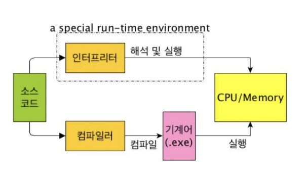
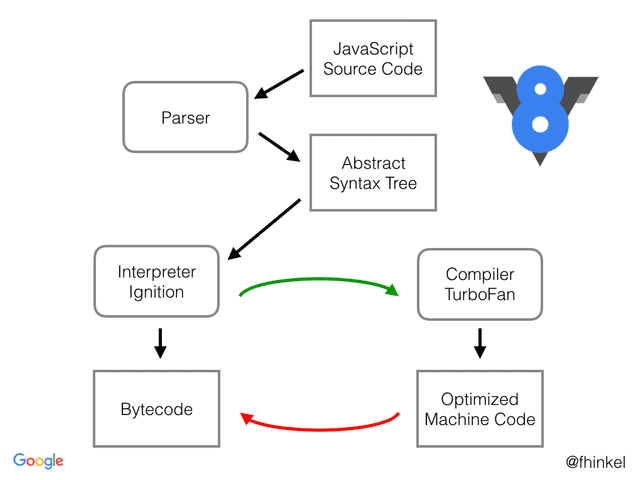
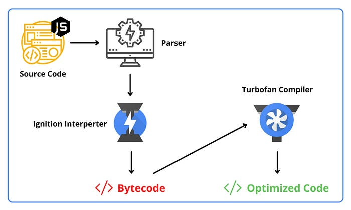

## 용어 정리
### 바이너리 코드(binary code)
컴퓨터가 인식할 수 있는 0과 1로 구성된 이진수로 표현된 코드를 의미합니다.

<br />
<br />
<br />

### 기계어(machine language)
>컴퓨터의 CPU가 직접 이해하고 실행할 수 있는 바이너리 코드

- CPU가 직접 실행할 수 있는 유일한 형태의 코드
- 바이너리 코드로 이루어져 있습니다.
- 어셈블리어보다 더 저수준의 언어로, 0과 1의 비트 패턴으로 구성됩니다.
- 기계어가 바이너리 코드로 이루어졌을 뿐이지 모든 바이너리 코드가 기계어인 것은 아닙니다. ( 바이너리 코드 != 기계어)
 - 기계어는 특정한 언어가 아닙니다.
	 - 단지 CPU제조사에서 CPU를 만들 때 해당 CPU에서 사용하는 명령어 집합을 공개하는데, 이것을 '기계어'라고 부를 뿐입니다.
	 - 때문에 CPU가 변경되면 기계어가 달라집니다. 같은 동작을 하는 명령어지만 완전히 다른 0과 1의 나열이 될 수 있다는 말입니다.
- 기계어는 컴파일러나 어셈블러에 의해 자동으로 생성됩니다.
- 예시
```
10110000 00000001 ; MOV AX, 1을 기계어로 표현
00000001 11000011 ; ADD AX, BX를 기계어로 표현
11101001 11000000 ; JMP LABEL을 기계어로 표현
```

<br />
<br />
<br />

### 어셈블리어(Assembly Language)
>기계어와 일대일 대응이 되는 컴퓨터 프로그래밍의 저급 언어

- 기계어에서 한 단계 위의 언어
- 기계어 명령어에 대한 사람이 읽을 수 있는 기호적 표현입니다.
- 기계어의 이진 명령어를 사람이 이해하기 쉬운 형태로 표현합니다.

1. **구성**:
    
    - **명령어(OpCodes)**: ADD, SUB, MOV, JMP 등 기계어 명령어를 대체하는 기호.
    - **레지스터(Registers)**: CPU의 데이터 저장소를 나타내는 기호 (예: AX, BX, CX).
    - **주소 및 상수(Addressing and Constants)**: 메모리 주소나 상수를 나타내는 기호.
2. **사용**:
    
    - 어셈블리어는 주로 시스템 프로그래밍, 임베디드 시스템, 디바이스 드라이버 개발에 사용됩니다.
    - 각기 다른 CPU 아키텍처에 맞춰 어셈블리어 코드가 작성됩니다.
3. **예시**:
```assembly
MOV AX, 1        ; 레지스터 AX에 1을 저장
ADD AX, BX       ; 레지스터 AX에 BX 값을 더함
JMP LABEL        ; LABEL로 점프
```

<br />
<br />
<br />

### 가상 머신(Virtual Machine, VM)
>물리적인 컴퓨터와는 달리 소프트웨어로 구현된 (가상의) 컴퓨터 시스템

중간 언어를 실행하기 위한 소프트웨어나 하드웨어 기반의 가상적 실행 환경을 의미합니다.

예를 들어 `script.py` 라는 고급 언어로 작성 되어 있는 고급 언어를 실행시키고 싶다면,

터미널에서

```bash
python script.py
```

파이썬의 인터프리터 (가상머신) 를 이용해서 고급언어를 중간 언어로 번역 시키고 , 가상 머신에서 실행시킬 수 있습니다.

<br />
<br />
<br />

### 추상 구문 트리(abstract syntax tree, AST)
>프로그래밍 언어의 소스 코드를 구조화한 트리 형태의 표현입니다. 이는 컴파일러나 인터프리터가 소스 코드를 이해하고 처리하기 위해 사용하는 중간 표현 단계입니다.

AST는 코드의 **문법적인 구조를 추상화하여 표현**합니다.
여기서 '추상화'는 실제 코드의 구체적인 문법 요소들을 제거하고, 그 핵심적인 구조와 의미만을 남기는 과정을 말합니다. 예를 들어, 괄호나 세미콜론 같은 구체적인 구문 요소들은 AST에서는 생략됩니다.

보통 **파싱(Parsing)** 을 소스코드를 불러온 후 AST로 변환하는 과정이라고 표현합니다.

<br />
<br />
<br />

### 바이트 코드(Bytecode)
>고급언어로 작성된 소스코드를 가상 머신이 이해할 수 있는 중간 코드로 컴파일한 것을 말합니다.

- CPU가 이해할 수 있는 언어가 바이너리 코드라면 바이트 코드는 가상 머신이 이해할 수 언어입니다.
- CPU가 아닌 가상 머신에서 이해할 수 있는 코드를 위한 이진 표현법입니다. (즉, 가상 머신이 이해할 수 있는 0과 1로 구성된 이진코드를 의미.)

<br />
<br />
<br />

### 컴파일 (Compile)
(고수준의) 프로그래밍 언어(소스코드)를 기계어 혹은 기계어와 유사한 low level까지 해석하는 과정입니다.

즉, 컴파일이 된 이후의 코드는 언어에 따라 바이트 코드인 경우도 있고 기계어로 직접 변환이 되는 경우도 있습니다.

ex)
C -> Assembly <br />
Java -> bytecode

<br />
<br />
<br />

### 컴파일러(Compiler)
(고수준의) 프로그래밍 언어를 기계어로 빠르게 컴파일할 수 있도록 미리 번역해둔 프로그램

<br />
<br />
<br />

### 트랜스파일 (Transpile)
프로그래밍 언어(소스코드)를 비슷한 수준의 추상화를 가진 다른 언어로 변환하는 과정입니다.

ex)
C++ -> C <br />
ES6 -> ES5 (Babel) <br />
typescript / coffescript -> javascript <br />
sass / scss -> css

<br />
<br />
<br />

### object code
기계어나 기계어 수준의 바이너리 코드로 해석된 코드를 의미합니다.

<br />
<br />
<br />

### 인터프렛(interpret)과 인터프리터(Interpreter)
(고수준의) 프로그래밍 언어를 각 행마다 해석하며 기계어로 번역 및 즉시 실행하는 방식을 뜻합니다.
인터프리터는 이 인터프렛이 가능하게 해주는 프로그램을 의미합니다.
인터프리터는 런타임에 코드를 한 줄씩 읽고 실행하며, '실행 파일'은 만들지 않습니다.


<br />
<br />
<br />
<br />

## 인터프리터 언어 vs 컴파일 언어


인간이 읽기 편한 고수준의 프로그래밍 언어를 컴퓨터가 읽을 수 있게 저수준의 **기계어로 변환**하기 위해 대표적으로 2가지가 있다고 보면 됩니다.
컴파일러와 인터프리터 방식이 바로 그것입니다.

<br />

### 인터프리터 언어
- 인터프리터 언어는 프로그램을 한 줄씩 읽어 들이면서 즉시 실행하는 방식입니다.
- 인터프리터는 런타임에 소스 코드를 직접 해석하고 실행하므로, 컴파일 과정이 필요하지 않습니다. 이는 개발 과정에서 빠른 피드백을 받아 실시간으로 코드를 수정하거나 디버깅할 수 있다는 장점이 있습니다.
- 인터프리터 언어는 동적 타이핑을 지원하여 변수의 타입을 명시하지 않아도 되므로 코드 작성이 간결해집니다.
- 컴파일러와 같은 오브젝트 코드 생성과정이 없기 때문에 메모리 효율이 좋다.
- 한번에 한 문장씩 해석하기 때문에 프로그램을 실행시키고 한 문장씩 해석될때 오류를 만나게 되면 바로 프로그램을 중지하게 됩니다. 즉, 런타임이 되어서야 오류 발견이 가능해서 사용성에 문제가 될 수 있습니다.
- 인터프리터 언어는 실행 속도가 상대적으로 느리다는 단점이 있습니다. 매 실행 시마다 소스 코드를 해석해야 하므로, 대규모 프로그램이나 복잡한 연산을 수행할 때는 성능 저하가 발생할 수 있습니다.
- 또한, 소스 코드가 그대로 노출되므로 코드 보안에 취약할 수 있습니다.

<br />

### 컴파일 언어
- 컴파일러 언어는 소스 코드를 기계어로 변역하는 컴파일 과정을 거칩니다.
- 컴파일러는 소스 코드 전체를 한 번에 분석하고, 최적화를 수행한 후 실행 파일을 생성합니다.
- 이렇게 개발 과정에서 컴파일 시간이 소요되므로, 인터프리터 언어에 비해 개발 속도가 느릴 수 있습니다.
- 하지만, 컴파일러는 전체 코드를 검사한 후에 오류 메시지를 생성하기 때문에 프로그램 실행 전에 오류를 발견 할 수 있습니다.
- 또한 컴파일 과정을 거쳐 생성된 실행 파일은 컴퓨터에서 직접 실행될 수 있으므로 전체 실행 시간만 따지고 보면 인터프리터 언어보다 빠릅니다.
- 컴파일 된 코드는 기계어로 변환되어 소스 코드의 로직이 직접 노출되지 않아 소스 코드를 공개하지 않아도 실행 파일을 배포할 수 있습니다.

위 비교 내용을 간단한 표로 정리하면 다음과 같습니다.

|        |                           인터프리터                            |                                  컴파일러                                   |
| :----- | :--------------------------------------------------------: | :---------------------------------------------------------------------: |
| 개발 편의성 | - 코드를 수정하고 즉시 실행할 수 있다.<br>- 보통 동적 타이핑을 지원하여 코드 작성이 간결해진다. | - 코드를 수정하고 실행하려면 컴파일을 다시 해야 한다.<br>- 보통 정적 타이핑을 지원하여 엄격한 타입 작성을 필요로 한다. |
| 실행 속도  |                            느리다                             |                                   빠르다                                   |
| 보안     |                    프로그램의 코드가 유출될 수 있다.                     |                           프로그램의 코드가 유출되지 않는다.                           |
| 오류 검출  |                  런타임이 되어서야 오류를 검출할 수 있다.                   |                    런타임이 아닌 컴파일 하는 과정에서 오류를 검출할 수 있다.                    |

<br />
<br />
<br />
<br />

## JIT vs 인터프리터
<mark style="background: #ADCCFFA6;">동적 컴파일</mark> 이라고도 불리는 JIT(Just in time)는 컴퓨터 프로그램의 런타임 성능을 개선하기 위해서 사용되는 기술입니다.

JIT는 인터프리터와 정적 컴파일을 혼합한 방식으로 생각할 수 있습니다. **프로그램 실행 시점에서 인터프리터 방식으로 기계어 코드를 생성하면서 그 코드를 캐싱**하여, 같은 함수가 여러 번 불릴 때마다 매번 기계어 코드를 생성하는 것을 방지합니다.

<mark style="background: #BBFABBA6;">바이트코드에서 번역된 기계어는 캐시에 저장</mark>되기 때문에 재사용시 다시 번역할 필요가 없습니다. 또한 코드가 반복된다면 재사용할 수 있으므로 시간이 단축됩니다.

<br />

### 동적 컴파일의 단점

동적 컴파일은 정적 컴파일의 단점(실행 환경이 바뀌면 동작된다는 보장이 없음)을 보완합니다. 실행 시 컴파일하기 때문에 실행 환경에 따라 동작을 보장할 수 있으며, 컴파일을 환경에 맞게 최적화할 수 있습니다.

하지만 이러한 특징으로 인해 컴파일된 내용을 메모리에 상주시켜야 하므로 메모리 사용량이 늘어나게 됩니다. 또한 수행 시 컴파일을 병행하므로 실행 지연이 발생합니다. 이러한 단점을 보완하기 위해 적응형 컴파일이 등장했습니다.

<br />

### 적응형 컴파일(Adaptive Compilation)
JIT 컴파일러의 단점을 보완하기 위한 방식으로, 코드가 사용되었을 때 즉시 컴파일하는 것이 아니라, **여러 번 호출된 후 지연시켜 컴파일을 수행하는데 이를 Lazy Compilation이라 합니다.**

<br />
<br />
<br />
<br />

## 자바스크립트 파싱과 실행

### 1. 자바스크립트 소스코드 -> 바이트 코드
자바스크립트는 기본적으로 text형식이기 때문에, 코드를 실행하기 전에 해석하는 컴파일 과정이 필요합니다. 먼저 소스코드를 파싱하여 중간언어(IR)인 바이트코드(Bytecode) 형태로 변환합니다.

1. 코드를 최소한의 문법적으로 의미있는 조각(=토큰)으로 나누는 **토크나이징** (이때 스코프가 결정되므로 자바스크립트는 렉시컬스코프를 가지게 된다.)
2. 토큰에 문법적 의미와 구조를 반영한 트리 구조로 나타내는 **AST로 만드는 파싱**
3. VM이 실행할 수 있도록 AST를 **바이트코드로 변환하는 컴파일**

여기서 AST를 바이트 코드로 변환시키는 주체는 Ignition Interpreter입니다.

<br />
<br />

### 바이트 코드 -> 실행
만들어진 바이트 코드를 <mark style="background: #BBFABBA6;">Ignition interpreter</mark>가 실행함으로써 자바스크립트 코드가 실행됩니다.

V8 엔진은 바이트 코드를 실행하면서 코드의 실행 패턴을 모니터링합니다. <mark style="background: #BBFABBA6;">자주 실행되는 코드 경로(핫스팟, hotspot)를 감지</mark>합니다. 이런 모니터링 과정 자체를 <mark style="background: #FFB8EBA6;">프로파일링</mark>이라 부르는 것 같습니다. 수집한 정보를 바탕으로 최적화가 필요한 부분을 식별합니다.

<mark style="background: #ADCCFFA6;">TurboFan 컴파일러</mark>를 통해 핫스팟으로 감지된 즉, 자주 실행되는 코드 경로를 최적화 기법을 사용하여 기계어로 컴파일합니다. 최적화된 <mark style="background: #ADCCFFA6;">기계어 코드가 생성되면 캐시에 저장</mark>됩니다.

저장된 기계어 코드는 CPU가 이해하고 처리할 수 있는 저수준의 코드이기에 직접 실행될 수 있어 성능이 향상될 수 있습니다.

<br />
<br />
<br />

#### TurboFan Compiler의 최적화 기법
**히든 클래스(Hidden Class)**<br />
쉽게 말해 객체를 정적 언어에서의 클래스처럼 다뤄 이미 만들어진 클래스의 구조를 전이 받는 방식이라고 할 수 있습니다.<br />
이는 자바스크립트의 동적 프로퍼티 변경에 대응하기 위한 방법이라고 볼 수 있습니다.

히든 클래스의 동작 방식을 간단하게 보자면,
1. **객체 생성**:
    - 객체가 생성될 때 V8 엔진은 기본 히든 클래스를 할당합니다.
```js
let obj = {}; // obj는 기본 히든 클래스를 가짐 (C0)
```
2. **속성 추가**:
    - 객체에 새로운 속성이 추가되면, V8 엔진은 기존 히든 클래스를 복사하여 새로운 속성이 포함된 새로운 히든 클래스를 생성합니다.
```js
obj.x = 10; // obj의 히든 클래스가 C0에서 C1으로 전이
```
3. **속성 변경**:
    - 추가적인 속성이 계속 추가되거나 변경될 때마다, 히든 클래스는 계속 전이됩니다.
```js
obj.y = 20; // obj의 히든 클래스가 C1에서 C2로 전이
```

히든 클래스를 사용하면 **빠른 속성 접근**이 가능하다는 장점이 있습니다.
동일한 히든 클래스를 가진 객체는 동일한 메모리 레이아웃을 가지므로, 속성 접근 시 오프셋 계산이 빨라집니다.

<br />

**인라인 캐싱(Inline Caching)**<br />
자주 사용되는 메서드 호출이나 속성 접근을 캐싱하여 성능을 최적화하는 기법입니다.
코드가 만약 `hello()`와 같은 함수의 호출부라면 이걸 `function hello () { ... }`와 같이 함수의 내용으로 바꿔버리는 것입니다. 말 그대로 `캐싱(Caching)`

<br />
<br />
<br />

위에서 쭉 얘기한 V8 엔진의 고수준 아키텍쳐를 보자면 아래와 같습니다.





<br />
<br />
<br />

## 레퍼런스
1. https://meetup.nhncloud.com/posts/77
2. https://inpa.tistory.com/entry/CS-%F0%9F%96%A5%EF%B8%8F-%EC%BB%B4%ED%8C%8C%EC%9D%BC-%ED%8A%B8%EB%9E%9C%EC%8A%A4%ED%8C%8C%EC%9D%BC-%EC%9D%B8%ED%84%B0%ED%94%84%EB%A6%AC%ED%84%B0-%EB%B9%84%EA%B5%90-%EC%89%BD%EA%B2%8C-%EC%84%A4%EB%AA%85
3. https://ui.toast.com/posts/ko_20210909
4. 모던 자바스크립트
5. https://velog.io/@wish/JavaScript%EB%8A%94-%EC%96%B4%EB%96%BB%EA%B2%8C-%EC%BB%B4%ED%8C%8C%EC%9D%BC%EB%90%A0%EA%B9%8C
6. https://evan-moon.github.io/2019/06/28/v8-analysis/