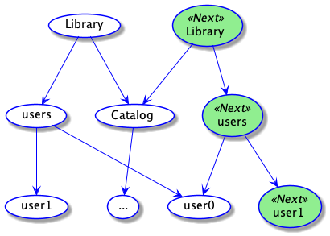

<br />
<br />

## 공식 문서에 나와있는 structural sharing에 대한 설명

**structural sharing**
React Query uses a technique called "structural sharing" to ensure that as many references as possible will be kept intact between re-renders. If data is fetched over the network, usually, you'll get a completely new reference by json parsing the response. However, React Query will keep the original reference if nothing changed in the data. If a subset changed, React Query will keep the unchanged parts and only replace the changed parts.

Note: This optimization only works if the queryFn returns JSON compatible data. You can turn it off by setting structuralSharing: false globally or on a per-query basis, or you can implement your own structural sharing by passing a function to it.

<br />

**구조적 공유**
React Query는 '구조적 공유'라는 기술을 사용하여 재렌더링 사이에 가능한 한 많은 참조가 그대로 유지되도록 합니다. 네트워크를 통해 데이터를 가져올 경우, <mark style="background: #FFB8EBA6;">일반적으로</mark> 응답을 JSON 파싱함으로써 **완전히 새로운 참조**를 얻게 됩니다. <mark style="background: #ADCCFFA6;">하지만</mark> React Query는 데이터에 변동이 없다면 **원래의 참조를 유지**합니다. 일부 데이터가 변경된 경우, React Query는 변경되지 않은 부분은 유지하고 변경된 부분만 교체합니다.

참고: 이 최적화는 queryFn이 JSON 호환 데이터를 반환할 때만 작동합니다. 구조적 공유를 전역적으로 또는 쿼리별로 false로 설정하여 끌 수 있으며, 함수를 전달하여 자체적인 구조적 공유를 구현할 수도 있습니다.

<mark style="background: #BBFABBA6;">위 말을 요약하자면</mark>, 쉽게 말해서 쿼리 결과들에 대한 레퍼런스가 데이터가 실제로 변경이 됐을 때만 변경되게끔 만든다는 뜻입니다.

<br />
<br />
<br />

### Structural Sharing를 통한 최적화

React Query는 새로운 데이터를 만들 때 가능한 한 기존의 데이터를 유지하려고 합니다. 아래 코드와 같이 응답받은 데이터가 있을 때,

```json
[
  { "id": 1, "name": "Learn React", "status": "active" },
  { "id": 2, "name": "Learn React Query", "status": "todo" }
]
```

서버에서 `id` 1에 대한 값이 업데이트되었다면, React Query는 아래 코드와 같이 모든 데이터를 교체하지 않고 변경된 값만 교체하여 기존의 데이터는 유지합니다.

```diff
[
- { "id": 1, "name": "Learn React", "status": "active" },
+ { "id": 1, "name": "Learn React", "status": "done" },
  { "id": 2, "name": "Learn React Query", "status": "todo" }
]
```

React Query는 이전 데이터를 유지함으로 변경되지 않은 데이터를 사용하는 컴포넌트에서는 리렌더링이 발생하지 않도록 최적화합니다. 기존의 데이터를 유지하지 않고 항상 새로운 데이터로 사용하기 위해서는 `structuralSharing` 옵션을 `false`로 설정하면 됩니다.

<br />
<br />
<br />

### 어떻게 이게 가능한 것일까요?

```js
const a = [1, 2, 3]
const b = [1, 2, 3]

console.log(a === b) // ?
```

자바스크립트를 공부한 사람이라면 위 코드에서 false가 로그로 찍힌다는 것을 알 수 있습니다.

네트워크를 통해 데이터를 가져올 경우 일반적으로는 매번 참조주소값이 달라지므로 사실 상 매번 다른 데이터를 받아오는 것입니다. 
리액트 쿼리는 어떤 방법으로 불필요한 리렌더링을 최소화했을까요?

궁금해서 tanstack query 내부에서 동작하는 코드를 찾아봤습니다.
정답은 [replaceEqualDeep 함수](https://github.com/TanStack/query/blob/b0c09aa63d7b8dad84d34ee5ba49d280032e467d/packages/query-core/src/utils.ts#L217)에 있었습니다.

`replaceEqualDeep`함수 내부에서 사용하는 관련된 함수들까지 복사해서 가져와봤습니다.

```ts
/* eslint-disable no-prototype-builtins */
export function isPlainArray(value: unknown) {
  return Array.isArray(value) && value.length === Object.keys(value).length;
}

function hasObjectPrototype(o: any): boolean {
  return Object.prototype.toString.call(o) === '[object Object]';
}

// Copied from: https://github.com/jonschlinkert/is-plain-object
export function isPlainObject(o: any): o is object {
  if (!hasObjectPrototype(o)) {
    return false;
  }

  // If has no constructor
  const ctor = o.constructor;
  if (ctor === undefined) {
    return true;
  }

  // If has modified prototype
  const prot = ctor.prototype;
  if (!hasObjectPrototype(prot)) {
    return false;
  }

  // If constructor does not have an Object-specific method
  if (!prot.hasOwnProperty('isPrototypeOf')) {
    return false;
  }

  // Handles Objects created by Object.create(<arbitrary prototype>)
  if (Object.getPrototypeOf(o) !== Object.prototype) {
    return false;
  }

  // Most likely a plain Object
  return true;
}

/**
 * This function returns `a` if `b` is deeply equal.
 * If not, it will replace any deeply equal children of `b` with those of `a`.
 * This can be used for structural sharing between JSON values for example.
 */
export function replaceEqualDeep<T>(a: unknown, b: T): T;
export function replaceEqualDeep(a: any, b: any): any {
  // a와 b가 primitive type 혹은 a와 b가 같은 참조값이면 a를 반환
  if (a === b) {
    return a;
  }

  const array = isPlainArray(a) && isPlainArray(b);

  // 둘 다 배열이거나 둘 다 plain object면
  if (array || (isPlainObject(a) && isPlainObject(b))) {
    const aItems = array ? a : Object.keys(a);
    const aSize = aItems.length;
    const bItems = array ? b : Object.keys(b);
    const bSize = bItems.length;
    // 복사본을 저장할 배열 또는 object
    const copy: any = array ? [] : {};

    let equalItems = 0;

    for (let i = 0; i < bSize; i++) {
      const key = array ? i : bItems[i];
      // (배열 aItems에 있는 key이거나 a,b 둘 다 배열이고) && a[key]와 b[key]가 undefined이면
      if (((!array && aItems.includes(key)) || array) && a[key] === undefined && b[key] === undefined) {
        // 복사본에 해당 키의 값은 undefined로 저장
        copy[key] = undefined;
        // 둘 다 undefined로 같기 때문에 equalItems++
        equalItems++;
      } else {
        // 값이 undefined가 아니면 재귀적으로 replaceEqualDeep 호출
        copy[key] = replaceEqualDeep(a[key], b[key]);
        // 실질적으로 여기서 deep equal한지 확인
        // replaceEqualDeep에서 아래 return 문에서 a가 나왔으면 바로 밑 조건문 통과 equalItems++
        if (copy[key] === a[key] && a[key] !== undefined) {
          equalItems++;
        }
      }
    }

    // bSize가 0이거나 for문 전부 다 순회했을 때 aSize와 equalItems가 같으면 a를 반환
    return aSize === bSize && equalItems === aSize ? a : copy;
  }

  // a와 b가 다른 타입 혹은 다른 값일 경우 b를 반환
  return b;
}

```

<br />

코드의 핵심은 nested된 모든 프로퍼티까지 비교하여 <mark style="background: #BBFABBA6;">변경된 부분만을 새로운 b로 교체</mark>하고 그렇지 않다면 a를 활용하는 것입니다.
(a와 b가 완전 동일하다면 a, 일부만 변경되었다면 copy, 완전 다르다면 b를 반환하게 되는 로직입니다.)
재귀 함수를 통해서 이를 구현한 것을 확인할 수 있습니다.

이런 방식으로 리액트 쿼리는 실제로 데이터가 변경되었을 때만 레퍼런스가 변경되도록 할 수 있었던 것입니다.

<br />

>[!TIP] 위 코드가 이해가 안 될 경우
>간단한 중첩 객체를 대입시켜서 로직을 따라가면 이해하기 쉽다.


<br />
<br />
<br />

## 레퍼런스
1. https://tanstack.com/query/latest/docs/framework/react/guides/render-optimizations#structural-sharing
2. https://blog.klipse.tech/javascript/2021/02/26/structural-sharing-in-javascript.html
3. https://beomy.github.io/tech/react/tanstack-query-v5-api-reference/#react-query-api-%EB%A0%88%ED%8D%BC%EB%9F%B0%EC%8A%A4
4. https://imsangin.tistory.com/entry/React-Query%EC%97%90%EC%84%9C-%EB%8D%B0%EC%9D%B4%ED%84%B0-reference%EB%A5%BC-%EA%B4%80%EB%A6%AC%ED%95%98%EB%8A%94-%EB%B0%A9%EB%B2%95
