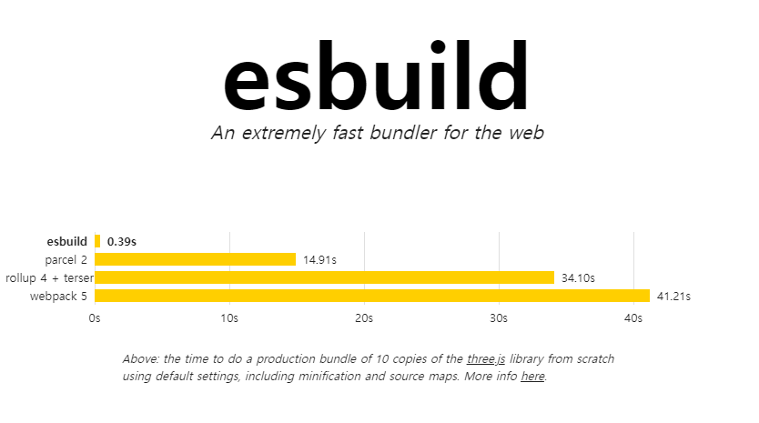

## TL;DR
> 빠른 개발 환경과 유연한 프로덕션 환경의 조합

Vite는 개발 환경과 프로덕션 환경에서 다른 방식으로 번들링을 처리한다.

개발 환경에서는 Vite가 ES Modules(ESM)를 이용하여 번들링 없이 빠른 모듈 재로딩(HMR, hot module replacement)을 제공한다. 서버가 클라이언트에게 필요한 모듈만 전송하고, 브라우저가 이 모듈들을 병렬로 로딩하게 함으로써 가능하다.

프로덕션 환경에서는 ESBuild를 빠른 변환과 미니파이케이션(Minification)을 위해 사용되고, 최종적으로  Rollup을 사용하여 번들링을 수행한다. Rollup은 트리 쉐이킹(tree shaking을 지원하며, 작은 번들(codesplitting)을 생성하고, 효율적인 코드 분할을 가능하게 한다. 이는 최종적으로 더 빠른 로딩 시간과 더 나은 성능을 제공한다. 


<br />
<br />
<br />

## 개요
- vite는 ESBuild의 단점(webpack, rollup처럼 유연하지 못하다. es6이하의 문법을 아직 100% 지원하지는 않는다.)을 보완시킨 빌드 툴이다.
- `Vue.js`의 창시자인 Evan You가 만든 **frontend build tool**이다.
- 관련있는 **번들러** webpack, esbuild, rollup에 대해서도 알아보자.


<br />
<br />
<br />

## 사전지식(webpack, esbuild와 rollup에 대하여)

vite는 번들링 과정에 esbuild와 rollup을 사용하므로 이에 대해 반드시 알고 넘어가야 할 필요가 있다. 그리고 vite가 webpack을 사용하지는 않지만, 기존의 대세 번들러 webpack에 대해서도 간단하게라도 비교할 수 있게 다뤄보자.
### [webpack](https://webpack.kr/)
2012년 등장
#### webpack의 정체성은 번들러의 순수한 목적인 "**통합**"에 있다.

- 오래된 번들러인만큼 그만큼 정보의 풀이 넓고 에러 해결법도 쉽게 찾아볼 수 있다.
- 설정 또한 굉장히 쉽다. 하나의 설정 파일에서 원하는 번들이 생성 될 수 있도록 컨트롤할 수 있다. `entry`와 `output`을 명시하고 어떤 `plugin`과 `loader`로 파일들을 다룰 건지 명시하면 된다.

예시 파일을 보자
```js
// webpack.config.js
const path = require('path');
const HtmlWebpackPlugin = require("html-webpack-plugin");

module.exports = {
  entry: {
    home: './pages/home.js',
  },
  output: {
    path: path.resolve(__dirname, 'dist'),
    filename: '[name].bundle.js',
  },
  module: {
    rules: [
      {
        test: /\.js
$
/,
        exclude: /node_modules/,
        use: ["babel-loader"],
      },
    ],
  },
  plugins: [new HtmlWebpackPlugin()],
};

```


<br />
<br />
<br />

#### webpack의 꽃은 code splitting이다.
code splitting은 파일들을 한 개가 아니라 여러 개의 번들 파일들로 분리해서 병렬로 스크립트를 로드할 수 있게 해준다. 이를 통해 구동될 필요가 없는 코드를 분리해서 **lazy loading**을 통해 페이지 로딩 속도를 개선시킬 수 있다.

아, 그리고 참고로 code splitting 지원은 이제 웬만한 builder들은 이제 다 기본적으로 장착하고 나온다([rollup](https://rollupjs.org/tutorial/#code-splitting), [esbuild](https://refine.dev/blog/what-is-esbuild/#bundling-and-supported-content-types), [parcel](https://parceljs.org/recipes/react/#code-splitting등등...) ). 그럼에도 불구하고 webpack이 가장 유명하고 최초라서 뜨지 않았나 싶다. 어쨌든 code splitting 지원이 더 이상 웹팩만의 장점은 아니라는 점이다.

<br />
<br />
<br />

#### 강력한 개발 서버 Hot Module ReplaceMent(HMR)
<mark style="background: #BBFABBA6;">HMR은 개발과정에서 소스코드의 변화를 감지하여 브라우저를 직접 새로고침할 필요가 없이 변화를 바로 반영해준다</mark>. 이 덕분에 개발자는 빠른 개발이 가능해졌다.

그런데 마찬가지로 HMR은 웬만한 번들러들은 이제 다 지원한다. 단지 최초가 Webpack이었을 뿐...

<br />
<br />
<br />

### [Rollup](https://rollupjs.org/)
2017년 등장
#### Rollup의 정체성은 "**확장**"이다.
홈페이지에 들어가보면 `Compile small pieces of code into something larger and more complex`라고 적혀있다. 작은 코드 조각들을 더 크고 복잡한 무엇인가로 컴파일해준다는 뜻이다. 그 크고 복잡한 무엇인가는 애플리케이션이나 라이브러리가 될 수 있겠다.

rollup 설정은 webpack과 아주 유사하다.

```js
// rollup.config.js
import commonjs from '@rollup/plugin-commonjs';
import resolve from '@rollup/plugin-node-resolve';
import { terser } from 'rollup-plugin-terser';

const production = !process.env.ROLLUP_WATCH;

export default {
  input: 'src/main.js',
  output: {
    file: 'public/bundle.js',
    format: 'iife',
    sourcemap: true,
  },
  plugins: [
    resolve(),
    commonjs(),
    production && terser(),
  ],
};
```

<br />
<br />
<br />

#### 🥊 vs Webpack 
- webpack은 내부적으로 Commonjs를 사용하고 rollup은 typescript(ES6)를 사용한다.
- rollup이 webpack보다 조금 더 빠르다. webpack은 모듈들을 함수로 감싸서 평가하는 방식을 사용하고, rollup은 모듈들을 상단으로 호이스팅해서 한번에 평가해서 성능상 이점이 있다.
- 쓰지 않는 코드를 build 과정에서 털어내어 용량을 줄이는 것을 `tree shaking`이라고 하는데 기본적으로 ES6 코드에서 제대로 동작한다. 그렇기 때문에 기본적으로 ES6를 쓰는 rollup이 더 가벼운 번들을 생성한다.


<br />
<br />
<br />

### [esbuild](https://esbuild.github.io/)
#### esbuild의 정체성은 "**빠른 속도**"이다.
ESbulid는 2020년에 출시된 차세대 번들러로써, 빠른 성능으로 각광받고 있는 번들러이다. ESbuild가 왜 빠른지에 대해 간단하게 알아보자.



<br />
<br />
<br />

#### esBuild는 왜 다른 번들러들보다 빠를까?
1. <mark style="background: #BBFABBA6;">`Go` 언어</mark>로 작성됨
   자바스크립트가 아니라 GO 언어로 작성된 Esbuild는 해당 사이트에서도 강조하고 있듯이 기존의  Webpack, Parcel, rollup 등의 다른 번들러들보다 10 ~ 100배 빠른 속도를 강조하고 있다.
2. 병렬성
   Go 언어의 강력한 병렬성을 적극 활용한 알고리즘들을 다수 활용하고 있다.
3. 처음부터 성능을 염두하고 만든 자체 parser이용
4경에서는 esbuild로 파일들을 통합(=사전 번들링)하고 프로덕션 환경에서는 rollup으로 유연하게 번들링 한다.

<br />

Vite가 탄생하게 된 배경과 해결방법에 대해서 다뤄보자.

<br />
<br />
<br />

### 1. 지루할 정도로 길었던 서버 구동
#### esbuild 사용하여 프리 번들링
vite는 **esbuild를 사용하여 사전 번들링**을 한다. 다른 번들러들보다 10 ~ 100배 빠르다.

#### 패키지와 소스코드 분리하여 따로 처리
기존의 번들러들은 몇 백개의 javascript 모듈을 갖고 있는 매우 큰 의존성에 대한 번들링 과정이 비효율적이었는데, 개발 중에 자주 변경되지 않는 의존성(패키지)와 소스코드를 따로 처리한다. 

위에서 얘기했다시피 vite는 의존성(패키지)을 **Esbuild를 통한 사전 번들링으로 해결**한다.

그리고 소스코드는 브라우저의 **native ES module(Native ESM)** 을 이용해 제공하기 때문에 브라우저가 번들러 작업 일부를 수행할 수 있도록 한다. native ES module은 우리가 알고 있는 바로 그 module javascript의 형태를 의미한다. vite는 브라우저가 요청하는 대로 소스코드를 변환하고 제공하기만 하면 된다.


<br />
<br />
<br />

### 2\. 느렸던 소스 코드 갱신
기존의 번들러 기반으로 개발을 진행하면, 소스 코드를 업데이트 했을 때 처음부터 번들링 과정을 다시 거쳐야 했다. 이에 따라서 서비스가 커질수록 당연히 소스 코드 갱신 시간 또한 길어졌다.

'모든 파일'을 번들링하고, 이를 다시 웹 페이지에서 불러오는 것은 굉장히 비효율적인 것이다. 이를 해결하기 위해 **HMR(Hot Module Replacement)** 라는 대안이 나왔던 것인데,  **vite는 이를 번들러가 아닌 ESM을 이용해 수행**한다. 예를 들어 어떤 모듈이 수정되면 vite는 그저 수정된 모듈과 관련된 부분만을 교체할 뿐이다.

또한 HTTP 헤더를 활용해서 전체 페이지의 로드 속도를 높인다. 필요에 따라 의존성을 캐시하여 요청 횟수를 최소화하여 페이지 로딩을 빠르게 만든다.

<br />
<br />
<br />

### 3\. 빌드 최적화
#### css 코드 분리
- 비동기적으로 불러와지는 청크 내에 css 코드가 포함된 경우 이를 자동으로 파일로 분리해놓는다. 나중에 해당 **청크 파일을 불러올 때 `<link>`태그를 이용해 분리된 css 코드를 불러오게끔 하며, 이 불러온 css 코드가 모두 계산된 후에 청크를 렌더링하도록 한다.**  이렇게 복잡한 과정을 거치는 이유는 이 과정을 통해 CSS가 렌더링될 때 화면이 잠깐 반짝이는 [FOUC 현상](https://en.wikipedia.org/wiki/Flash_of_unstyled_content#:~:text=A%20flash%20of%20unstyled%20content,before%20all%20information%20is%20retrieved.)을 회피할 수 있게 되기 때문이다.

<br />

#### Preload Directives Generation
vite는 빌드 시 **Direct Import 구문에 대해 `<link ref="modulepreload">` 디렉티브를 이용해 미리 모듈을 캐싱하도록 자동으로 변환**한다. 덕분에 해당 **모듈을 필요로 하는 경우 이를 바로 사용할 수 있게 된다.**


<br />

#### [Async Chunk Loading Optimization](https://ko.vitejs.dev/guide/features.html#async-chunk-loading-optimization)

(<mark style="background: #ABF7F7A6;">여기서부터는 공식문서에 적힌 내용</mark>)

<q>빌드 시, 때때로 Rollup은 "공통(Common)" 청크 파일을 생성합니다. 보통 두 개 이상의 모듈에서 공유되는 청크가 이러한데, 이를 Dynamic Import를 이용해 불러오는 경우 다음과 같은 상황이 발생됩니다. (브라우저는 `A`와 `B` 모듈을 필요로 하며(Dynamic Import), `A`와 `B` 모듈은 공통적으로 모듈 `C`를 필요로 하는 경우(Direct Import)입니다. - 옮긴이)</q>


최적화되지 않은 경우, 먼저 비동기적으로 `A` 청크가 불러와지게 되고, `A` 청크가 모두 파싱된 후에서야 `C` 청크가 필요하다는 사실을 알게 되기에 다음과 같은 네트워크 왕복이 필요합니다.

```
Entry ---> A ---> C
```

vite는 Preload 스텝을 이용해 **`A`를 가져올 때 `C` 청크를 병렬적(Parallel)으로 가져올 수 있도록 Dynamic Import 구문을 자동으로 재작성**합니다.

```
Entry ---> (A + C)
```
vite는 모든 Direct Import 구문에 대해 Preload 하도록 함으로써,** 쓸 데 없이 낭비되는 네트워크 왕복을 줄이도록 구성합니다.


<br />
<br />
<br />

## 레퍼런스
1. [(번역) ‘Create React App 권장을 Vite로 대체’ PR 대한 Dan Abramov의 답변](https://junghan92.medium.com/%EB%B2%88%EC%97%AD-create-react-app-%EA%B6%8C%EC%9E%A5%EC%9D%84-vite%EB%A1%9C-%EB%8C%80%EC%B2%B4-pr-%EB%8C%80%ED%95%9C-dan-abramov%EC%9D%98-%EB%8B%B5%EB%B3%80-3050b5678ac8)
2. 공식 문서(한글화 100%) - [https://ko.vitejs.dev/guide/why.html](https://ko.vitejs.dev/guide/why.html)
3. https://github.com/vitejs/vite/discussions/7622
4. https://velog.io/@minboykim/Vite-%EC%99%9C-%EC%93%B0%EB%8A%94%EA%B1%B0%EC%A7%80
5. https://esbuild.github.io/
6. https://rollupjs.org/
7. https://bepyan.github.io/blog/2023/bundlers
8. 관련 영상
    1. [https://youtu.be/j541SGnGcew?si=PkdvGM3VcQt6WlfB](https://youtu.be/j541SGnGcew?si=PkdvGM3VcQt6WlfB)(배포와 번들러의 기초 + vite에 대해서 - 시나브로 자바스크립트)
    2. [https://www.youtube.com/watch?v=UdTD_NAWxyE&list=PLqbk_vAq_YQZO6Pqf39dnd-AwC2dcFH3q&index=5](https://www.youtube.com/watch?v=UdTD_NAWxyE&list=PLqbk_vAq_YQZO6Pqf39dnd-AwC2dcFH3q&index=5)(위 영상 이어지는 내용 : vite 조금 더 뜯어보기 - 시나브로 자바스크립트)
    3. [https://youtu.be/iX3Nu1FcZKA?si=rKg0rX03LDyr_HFG](https://youtu.be/iX3Nu1FcZKA?si=rKg0rX03LDyr_HFG) - vite를 간단하게 설명(5분) - 코딩애플
